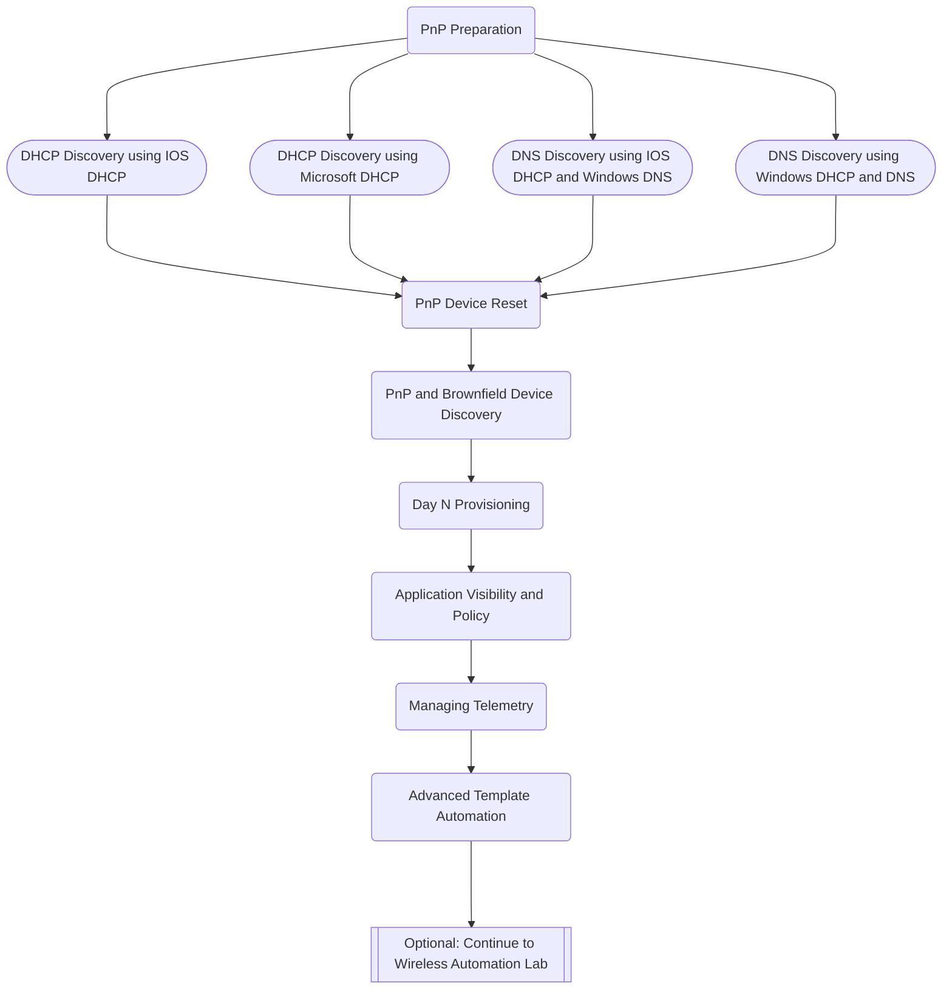
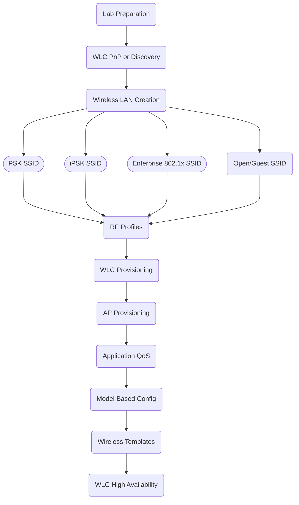

## How to Navigate the Site

### Wired Automation Lab

```mermaid
graph TD;
    box1(PnP Preparation);
    box3([DHCP Discovery using IOS DHCP]);
    box4([DHCP Discovery using Microsoft DHCP]);
    box5([DNS Discovery using IOS DHCP and Windows DNS]);
    box6([DNS Discovery using Windows DHCP and DNS]);
    box7(PnP Device Reset);
    box8(PnP and Brownfield Device Discovery);
    box9(Day N Provisioning);
    box10(Application Visibility and Policy);
    box11(Managing Telemetry);
    box12(Advanced Template Automation);
    box13[[Optional: Continue to Wireless Automation Lab]]
    box1--->box3 & box4 & box5 & box6;
    box3 & box4 & box5 & box6--->box7;
    box7-->box8;
    box8-->box9;
    box9-->box10;
    box10-->box11;
    box11-->box12;
    box12--->box13;
    click box1 "https://github.com/kebaldwi/DNAC-TEMPLATES/blob/master/LABS/LAB-1-Wired-Automation/module1-pnpprep.md" _blank
    click box3 "https://github.com/kebaldwi/DNAC-TEMPLATES/blob/master/LABS/LAB-1-Wired-Automation/module1a-dhcp-ios.md" _blank
    click box4 "https://github.com/kebaldwi/DNAC-TEMPLATES/blob/master/LABS/LAB-1-Wired-Automation/module1b-dhcp-svr.md"
    click box5 "https://github.com/kebaldwi/DNAC-TEMPLATES/blob/master/LABS/LAB-1-Wired-Automation/module1c-dns-ios.md"
    click box6 "https://github.com/kebaldwi/DNAC-TEMPLATES/blob/master/LABS/LAB-1-Wired-Automation/module1d-dns-svr.md"
    click box7 "https://github.com/kebaldwi/DNAC-TEMPLATES/blob/master/LABS/LAB-1-Wired-Automation/module1e-reset.md"
    click box8 "https://github.com/kebaldwi/DNAC-TEMPLATES/blob/master/LABS/LAB-1-Wired-Automation/module2-pnp.md"
    click box9 "https://github.com/kebaldwi/DNAC-TEMPLATES/blob/master/LABS/LAB-1-Wired-Automation/module3-dayn.md"
    click box10 "https://github.com/kebaldwi/DNAC-TEMPLATES/blob/master/LABS/LAB-1-Wired-Automation/module4-applicationqos.md"
    click box11 "https://github.com/kebaldwi/DNAC-TEMPLATES/blob/master/LABS/LAB-1-Wired-Automation/module5-telemetry.md"
    click box12 "https://github.com/kebaldwi/DNAC-TEMPLATES/blob/master/LABS/LAB-1-Wired-Automation/module6-advanced.md"
    click box13 "https://github.com/kebaldwi/DNAC-TEMPLATES/blob/master/LABS/LAB-2-Wireless-Automation/README.md"
```

## Wireless Automation Lab

```mermaid
graph TD;
    box1(Lab Preparation);
    box2(WLC PnP or Discovery);
    box3(Wireless LAN Creation)
    box4([PSK SSID]);
    box5([iPSK SSID]);
    box6([Enterprise 802.1x SSID]);
    box7(Open/Guest SSID);
    box8(RF Profiles);
    box9(WLC Provisioning);
    box10(AP Provisioning);
    box11(Application QoS);
    box12(Model Based Config);
    box13(Wireless Templates);
    box14(WLC High Availability)
    box1-->box2;
    box2-->box3;
    box3--->box4 & box5 & box6 & box7;
    box4 & box5 & box6 & box7--->box8;
    box8-->box9;
    box9-->box10;
    box10-->box11;
    box11-->box12;
    box12-->box13;
    box13-->box14;
    click box1 "https://github.com/kebaldwi/DNAC-TEMPLATES/blob/master/LABS/LAB-2-Wireless-Automation/preparation.md"
    click box2 "https://github.com/kebaldwi/DNAC-TEMPLATES/blob/master/LABS/LAB-2-Wireless-Automation/module1-ctrlpnpdiscovery.md"
    click box3 "https://github.com/kebaldwi/DNAC-TEMPLATES/blob/master/LABS/LAB-2-Wireless-Automation/module2-wlans.md"
    click box4 "https://github.com/kebaldwi/DNAC-TEMPLATES/blob/master/LABS/LAB-2-Wireless-Automation/module2a-psk.md"
    click box5 "https://github.com/kebaldwi/DNAC-TEMPLATES/blob/master/LABS/LAB-2-Wireless-Automation/module2b-ipsk.md"
    click box6 "https://github.com/kebaldwi/DNAC-TEMPLATES/blob/master/LABS/LAB-2-Wireless-Automation/module2c-eap.md"
    click box7 "https://github.com/kebaldwi/DNAC-TEMPLATES/blob/master/LABS/LAB-2-Wireless-Automation/module2d-open.md"
    click box8 "https://github.com/kebaldwi/DNAC-TEMPLATES/blob/master/LABS/LAB-2-Wireless-Automation/module3-rfprofiles.md"
    click box9 "https://github.com/kebaldwi/DNAC-TEMPLATES/blob/master/LABS/LAB-2-Wireless-Automation/module4-wlcprovisioning.md"
    click box10 "https://github.com/kebaldwi/DNAC-TEMPLATES/blob/master/LABS/LAB-2-Wireless-Automation/module5-approvisioning.md"
    click box11 "https://github.com/kebaldwi/DNAC-TEMPLATES/blob/master/LABS/LAB-2-Wireless-Automation/module6-applicationqos.md"
    click box12 "https://github.com/kebaldwi/DNAC-TEMPLATES/blob/master/LABS/LAB-2-Wireless-Automation/module7-modelbasedconfig.md"
    click box13 "https://github.com/kebaldwi/DNAC-TEMPLATES/blob/master/LABS/LAB-2-Wireless-Automation/module8-wirelesstemplates.md"
    click box14 "https://github.com/kebaldwi/DNAC-TEMPLATES/blob/master/LABS/LAB-2-Wireless-Automation/module9-controllerha.md"
```