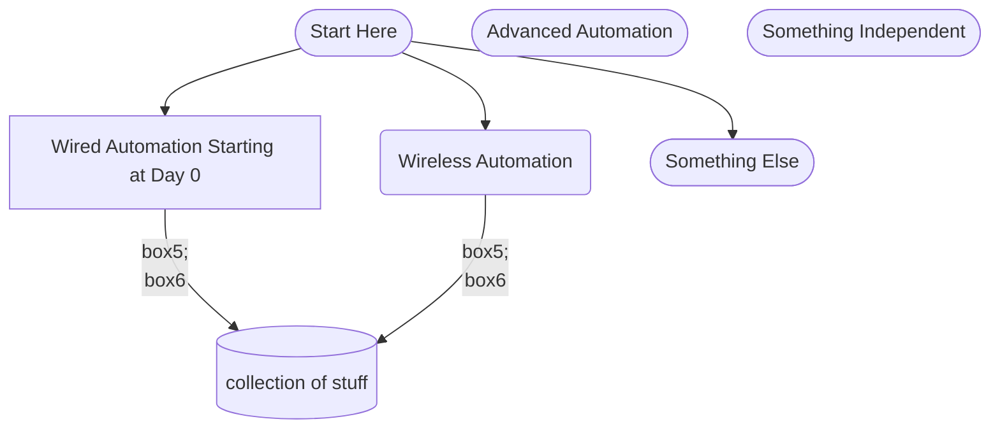

# Testing a flowchart with links using Mermaid

```mermaid
graph TD;
    box1([Start Here]);
    box2[Wired Automation Starting at Day 0];
    box3(Wireless Automation);
    box4([Something Else]);
    box5([Advanced Automation]);
    box6([Something Independent])
    box7[(collection of stuff)]
    box1-->box2 & box3 & box4;
    box2 & box3 -- box5;
    box6-->box7;
    click box2 "https://github.com/kebaldwi/DNAC-TEMPLATES/tree/master/LABS/LAB-1-Wired-Automation" "wired";
    click box3 "https://github.com/kebaldwi/DNAC-TEMPLATES/tree/master/LABS/LAB-2-Wireless-Automation" "wireless";
    click box5 "https://github.com/kebaldwi/DNAC-TEMPLATES/tree/master/LABS/LAB-3-Advanced-Automation" "advanced";
```
